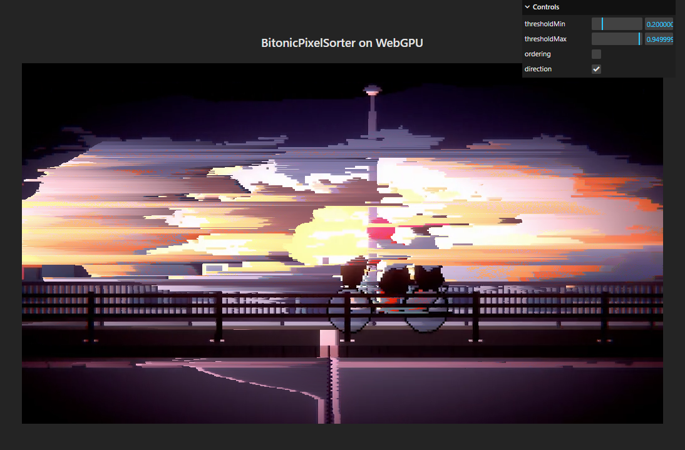

# BitonicPixelSorter-WebGPU Demo

[Open demo](https://ruccho.com/bps-webgpu)

A demo of the GPU-accelarated pixel sorter effect on WebGPU, [which is originally written for Unity](//ruccho/BitonicPixelSorter).

### Concept

This demo works with transpiled compute shaders originally written in HLSL (DirectCompute) for Unity. The transpilation is done with dxc (HLSL to SPIR-V) and tint (SPIR-V to WGSL). There are some compatibility issues that have to be fixed by hand (e.g. available TGSM size).

### References

 - [HLSL→WGSLへの変換をやってみる（SPIR-V経由）](https://nekocha.hatenablog.com/entry/2023/04/10/150132)
 - [BitonicPixelSorter - ruccho](//ruccho/BitonicPixelSorter)